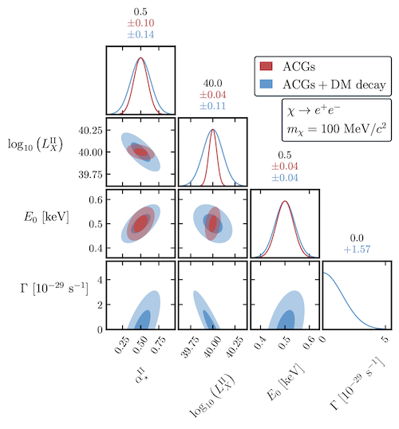

# 21cmCAST

[](https://github.com/gaetanfacchinetti/21cmCAST/actions/workflows/CI.yml?query=branch%3Amain)

[](https://pypi.org/project/py21cmcast/)
[](https://pypi.python.org/pypi/py21cmcast/)
[](https://www.gnu.org/licenses/gpl-3.0)

[](https://en.wikipedia.org/wiki/Cosmology)
[](https://en.wikipedia.org/wiki/Hydrogen_line)
[](https://en.wikipedia.org/wiki/Fisher_information)


This lightweight package provides tools to perform automated analysis of [21cmFAST](https://21cmfast.readthedocs.io/en/latest/)[^1][^2] outputs and in particular run Fisher fore**CAST**s. It has initially been built on / complementarily to the [21cmFish](https://21cmfish.readthedocs.io/en/latest/) package[^3]. 

---
 ⚠️ **If you are using this code**, please cite the following work for which it has been developped
> *Gaétan Facchinetti, Laura Lopez-Honorez, Yuxiang Qin, Andrei Mesinger*, 21cm signal sensitivity to dark matter decay [[JCAP 01 (2024) 005]](https://iopscience.iop.org/article/10.1088/1475-7516/2024/01/005) [[arXiv:2308.16656]](https://arxiv.org/abs/2308.16656)

</br>

<p align="center">
  
</p>


## Installation

In order to install the code you can install it with pip, running
```
pip install py21cmcast
```
To install a modified version of the code (or the latest version, available on github) clone this repository and run
```
pip install -e .
```
in the main folder. In addition, `meta.yaml` and `build.sh` files are provided for a manual installation with conda. However, the conda install is not garanteed to succeed since it has not been tested.

Although the installation should proceed and you should be able to import the package into your python environement, in order to analyse 21cmFAST raw data, the codes requires to have a working installation of 21cmFAST. For Fisher forcasts, you will need to install [21cmSense](https://21cmsense.readthedocs.io/en/latest/)[^4] in order to evaluate the sensitivity of instruments (current version works with 21cmSense version 2.0.0).


## Quick start guide

Examples on how to run the code are available [here](./examples/) along with an minimal example of input config file.


## Ongoing work

To do list:
- [x] rearrange the code in a self-contained package
- [ ] uniformely use astropy units throughout the entire code
- [ ] add docstrings to the classes


--- 
[^1]: *Andrei Mesinger, Steven Furlanetto, and Renyue Cen*, 21cmFAST: A Fast, Semi-Numerical Simulation of the High-Redshift 21-cm Signal [[arXiv:1003.3878]](https://arxiv.org/abs/1003.3878)

[^2]: *Andrei Mesinger and Steven Furlanetto*, Efficient Simulations of Early Structure Formation and Reionization [[arXiv:0704.0946]](https://arxiv.org/abs/0704.0946)

[^3]: *Charlotte A. Mason, Julian B. Muñoz, Bradley Greig, Andrei Mesinger, and Jaehong Park*, 21cmfish: Fisher-matrix framework for fast parameter forecasts from the cosmic 21-cm signal [[arXiv:2212.09797]](https://arxiv.org/abs/2212.09797)

[^4]: *Jonathan C. Pober, Adrian Liu, Joshua S. Dillon, James E. Aguirre, Judd D. Bowman et al.*, What Next-Generation 21 cm Power Spectrum Measurements Can Teach Us About the Epoch of Reionization [[arXiv:1310.7031]](https://arxiv.org/abs/1310.7031)
